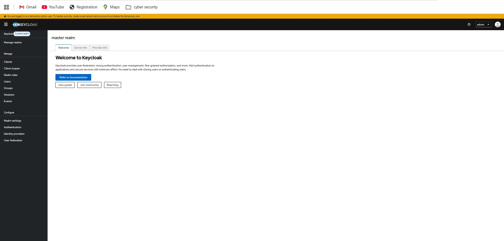
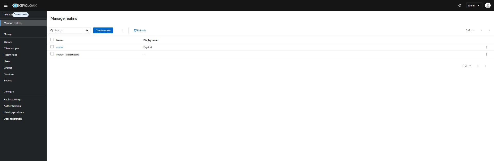
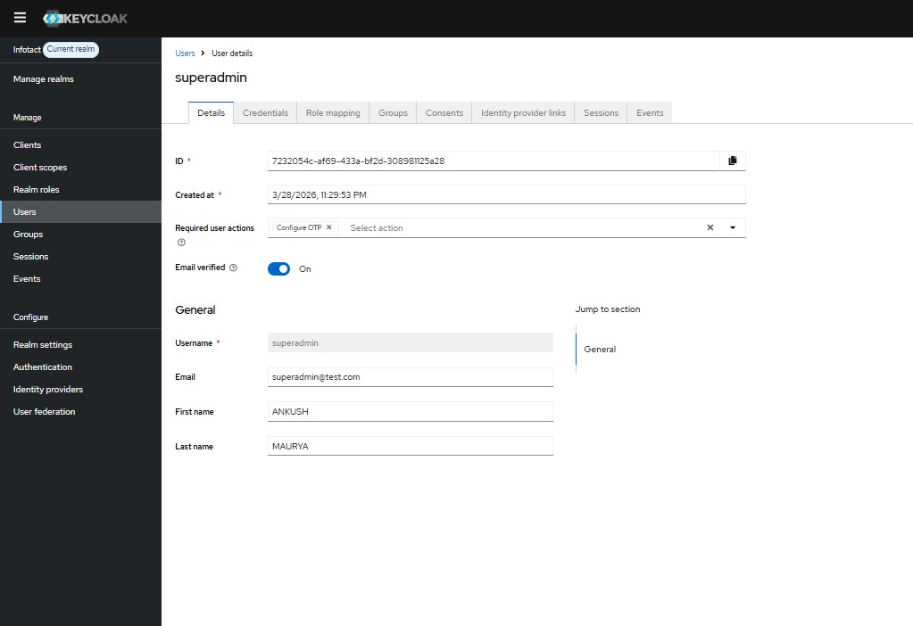
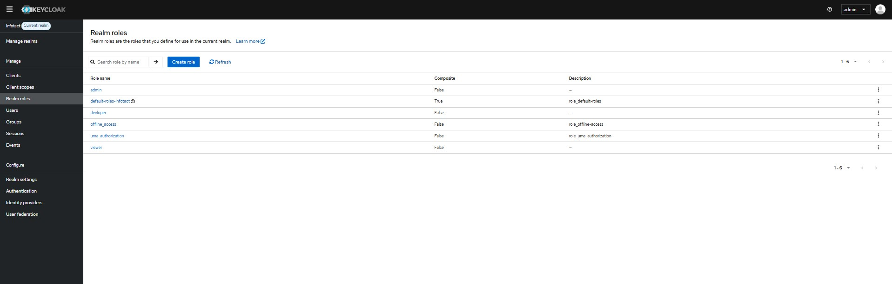

# Week 1 – Identity Infrastructure Setup using Keycloak

## Objective

The objective of Week 1 was to deploy a centralized Identity Provider using Keycloak and configure identity infrastructure required for Zero Trust Architecture.

---

## Tools Used

Docker Desktop  
Keycloak  
Windows PowerShell  
Browser Admin Console  

---

## Environment Setup

Operating System:

Windows 11

Container Platform:

Docker Desktop

Identity Provider:

Keycloak

---

## Step 1 – Docker Installation

Docker Desktop installed successfully.

Verification command:

docker --version

Purpose:

Used to deploy Keycloak container.

---
## Step 2 – Keycloak Container Deployment

Keycloak container pulled using Docker.

Command used:

docker pull quay.io/keycloak/keycloak

Container started using:

docker run -p 8080:8080 quay.io/keycloak/keycloak start-dev

Keycloak server available at:

http://localhost:8080

---

## Step 3 – Admin Console Login

Temporary admin user created.

Username:

admin

Password:

admin

Admin console accessed successfully.

---
## Step 4 – Realm Creation

New realm created:

Infotact

Purpose:

Isolates identity environment for Zero Trust implementation.

---

## Step 5 – Users Creation

Users created:

superadmin  
developer  
viewer  

Purpose:

Simulate multiple access-level identities.

---

## Step 6 – Roles Creation

Roles created:

Admin  
Developer  
Viewer  

Purpose:

Implements Role Based Access Control.

---
## Step 7 – Role Assignment

Roles assigned:

superadmin → Admin

developer → Developer

viewer → Viewer

---

## Input Commands Used

Docker verification:

docker --version

Keycloak container execution:

docker run -p 8080:8080 quay.io/keycloak/keycloak start-dev

Admin console access:

http://localhost:8080

---

## Output Achieved

Keycloak Identity Server deployed successfully.

Realm created successfully:

Infotact

Users authenticated successfully.

Roles configured successfully.

Admin console accessible through browser.

---

## Problems Faced

Problem 1:

Docker Desktop not starting initially.

Solution:

Restarted Docker service and enabled virtualization.

Problem 2:

Port 8080 conflict error occurred once.

Solution:

Stopped conflicting service and restarted container.

Problem 3:

Keycloak container stopped unexpectedly during first execution.

Solution:

Re-executed docker run command correctly.

---

## Screenshot Evidence

Admin Console Dashboard:

Realm Creation:

Users Creation:

Roles Creation:

---

## Result

Centralized Identity Provider successfully deployed using Keycloak.

Identity infrastructure ready for OpenID Connect integration.