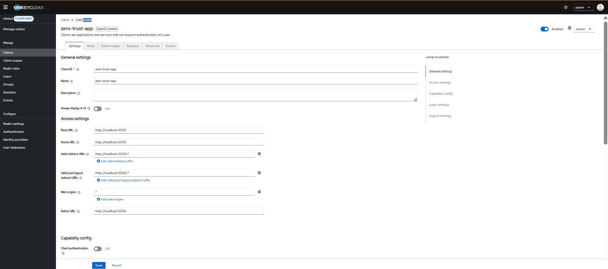

# Week 2 – OpenID Connect Integration with Backend Application

## Objective

The objective of Week 2 was to integrate the backend application with Keycloak using OpenID Connect (OIDC) protocol and secure APIs using JWT access tokens.

---

## Tools Used

Keycloak Identity Server  
Node.js  
Express.js  
JWT Token Authentication  
PowerShell  

---

## Environment Setup

Identity Provider:

Keycloak running on:

http://localhost:8080

Backend Server:

Node.js Express server running on:

http://localhost:5000

---

## Step 1 – OIDC Client Creation

Created new client inside Keycloak:

Client ID:

zero-trust-app

Protocol:

OpenID Connect

Purpose:

Enable authentication between backend application and Keycloak Identity Provider.

---

## Step 2 – Redirect URI Configuration

Configured redirect URI:

http://localhost:3000/*

Purpose:

Allows Keycloak to redirect authentication response back to application.

---

## Step 3 – Generated Access Token

Access token generated using Keycloak token endpoint:

http://localhost:8080/realms/Infotact/protocol/openid-connect/token

Grant Type Used:

Authorization Code Flow

Purpose:

Authenticate users securely and generate JWT token.

---

## Step 4 – Backend Integration with Keycloak

Connected Node.js backend with Keycloak public key endpoint:

http://localhost:8080/realms/Infotact/protocol/openid-connect/certs

Purpose:

Validate JWT token signature.

---

## Step 5 – Protected API Endpoint Created

Protected endpoint created:

http://localhost:5000/protected

Access rule:

Token required for access.

---

## Input Commands Used

Start backend server:

node server.js

Generate access token:

Invoke-RestMethod -Method Post `
-Uri "http://localhost:8080/realms/Infotact/protocol/openid-connect/token"

Test protected API:

Invoke-RestMethod `
-Uri "http://localhost:5000/protected" `
-Headers @{Authorization="Bearer ACCESS_TOKEN"}

---

## Output Achieved

JWT access token generated successfully.

Token decoded successfully.

Protected API response received:

Welcome superadmin! Secure access granted.

OIDC authentication working successfully.

---

## Problems Faced

Problem 1:

Unauthorized client error occurred during token generation.

Solution:

Enabled Direct Access Grants inside Keycloak client settings.

---

Problem 2:

Token verification failed initially.

Solution:

Correct Authorization header format used:

Authorization: Bearer ACCESS_TOKEN

---

Problem 3:

Invalid token error received once.

Solution:

Generated fresh access token and verified issuer configuration.

---

## Screenshot Evidence

OIDC Client Configuration:

Redirect URI Setup:

JWT Token Decode:

Protected API Output:

---

## Result

Secure authentication successfully implemented using OpenID Connect.

Backend API protected using JWT access token validation.