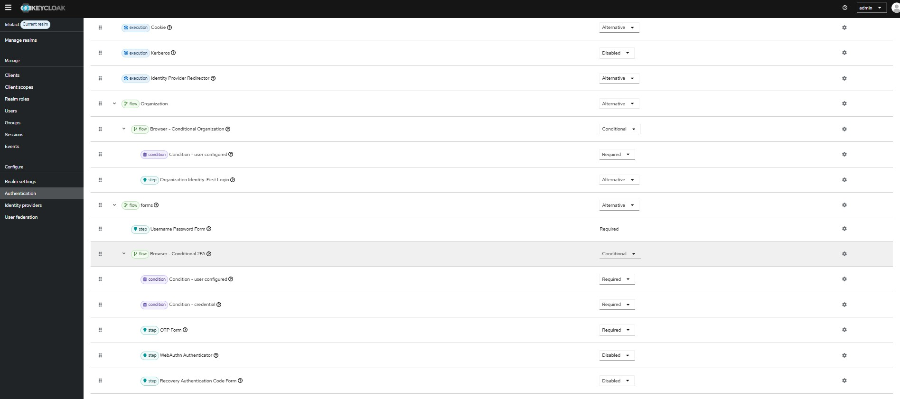
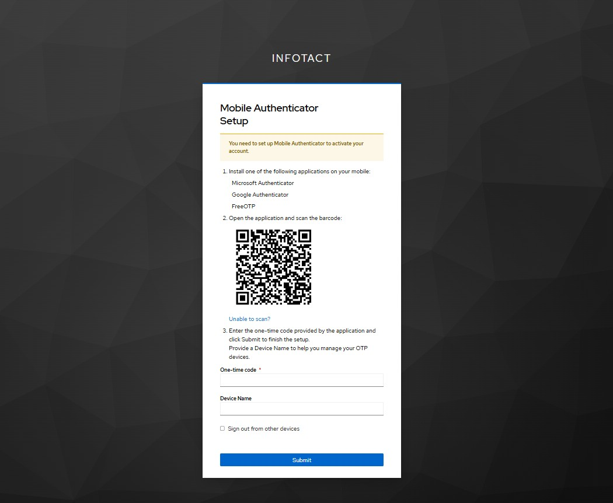
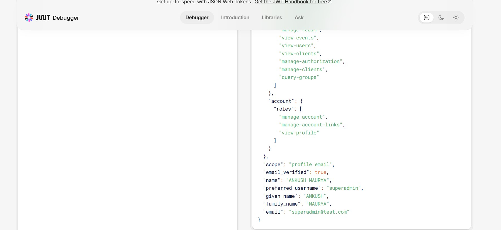
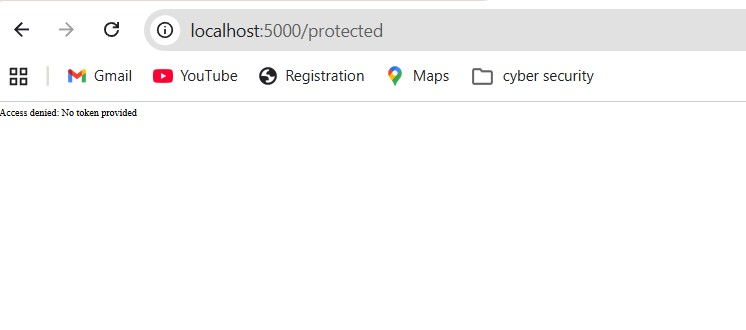

# Week 3 – Role-Based Access Control (RBAC) and Conditional Multi-Factor Authentication (MFA)

## Objective

The objective of Week 3 was to strengthen authentication security using Role-Based Access Control (RBAC) and Conditional Multi-Factor Authentication (MFA) in Keycloak.

This ensures that users authenticate with both password and OTP verification before accessing protected services.

---

## Tools Used

Keycloak Admin Console  
Google Authenticator  
JWT.io Token Decoder  
Node.js Backend API  
PowerShell Terminal  

---

## Step 1 – Role Verification in JWT Token

Previously created roles were verified inside access tokens.

Roles verified:

Admin  
Developer  
Viewer  

Purpose:

Ensure authorization decisions are role-based and securely validated through token claims.

---

## Step 2 – JWT Token Decode Validation

Access token decoded using:

https://jwt.io

Claims verified:

realm_access.roles  
preferred_username  
email  

Purpose:

Validate token integrity and confirm role assignment.

---

## Step 3 – Configure Conditional MFA Flow

Configured authentication flow inside Keycloak:

Browser Flow → Conditional 2FA → OTP Form

This ensures OTP verification is triggered after password authentication.

---

## Step 4 – Configure OTP Authenticator

Installed authenticator application:

Google Authenticator

Steps performed:

Scanned QR code  
Registered authenticator successfully  
Generated OTP  

Purpose:

Enable Time-based One-Time Password authentication.

---

## Step 5 – Secure Login Flow Testing

Verified authentication sequence:

Username  
Password  
OTP  

Access successfully granted after OTP validation.

---

## Input Configuration Used

Authentication Flow:

Browser Flow → Conditional 2FA Enabled

OTP Method:

Time-Based OTP (TOTP)

Authenticator Applications Supported:

Google Authenticator  
Microsoft Authenticator  

---

## Output Achieved

Conditional MFA successfully enabled.

Secure login enforced using OTP verification.

JWT token verified with correct role mapping.

Protected API successfully accessed after authentication.

Example API response:

Welcome superadmin! Secure access granted.

---

## Problems Faced

Problem 1:

Conditional MFA not triggering initially.

Solution:

Correct Browser authentication flow binding applied.

---

Problem 2:

OTP verification error occurred once.

Solution:

Reset OTP credential and reconfigured authenticator setup.

---

Problem 3:

Access token expired during validation.

Solution:

Generated fresh access token from Keycloak endpoint.

---

## Screenshot Evidence

OTP Setup Screen:

MFA Login Screen:

JWT Token Role Verification:

Protected API Secure Response:

---

## Result

Successfully implemented Conditional Multi-Factor Authentication with Role-Based Access Control.

System now enforces:

Identity verification  
Token validation  
Role-based authorization  
Multi-factor authentication