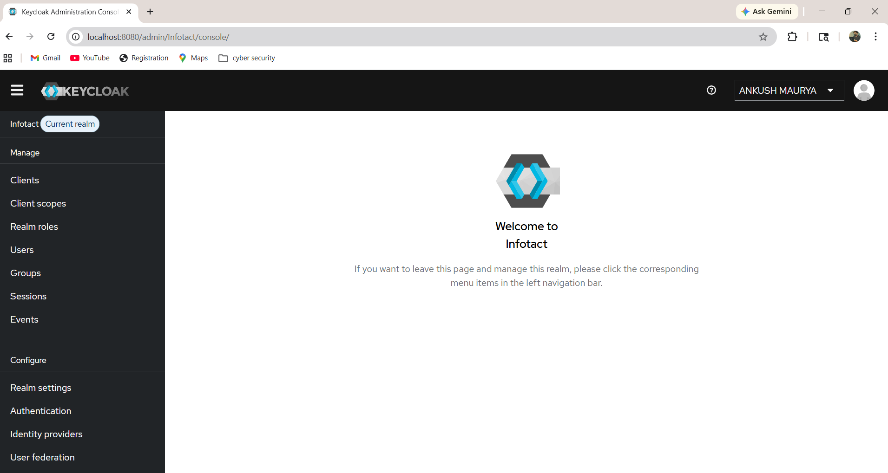
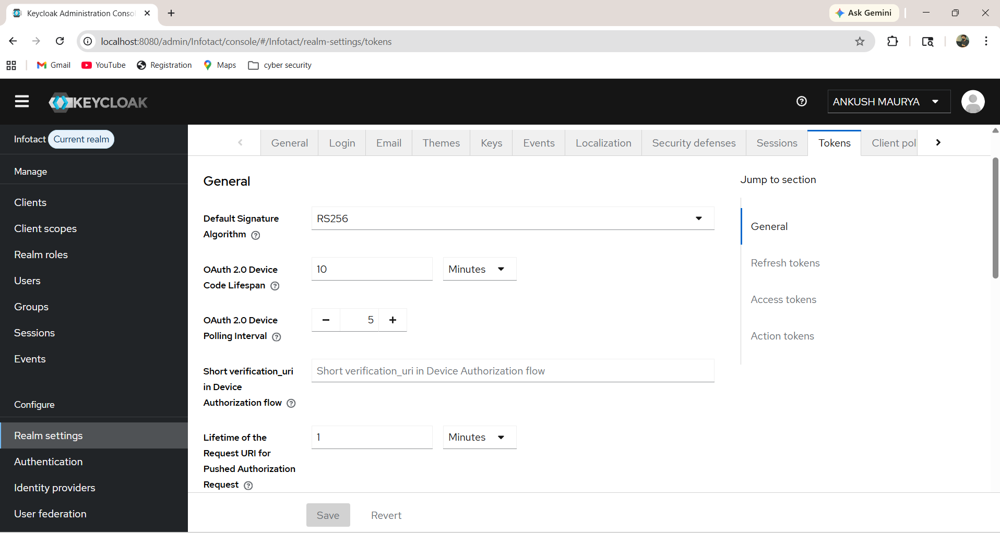
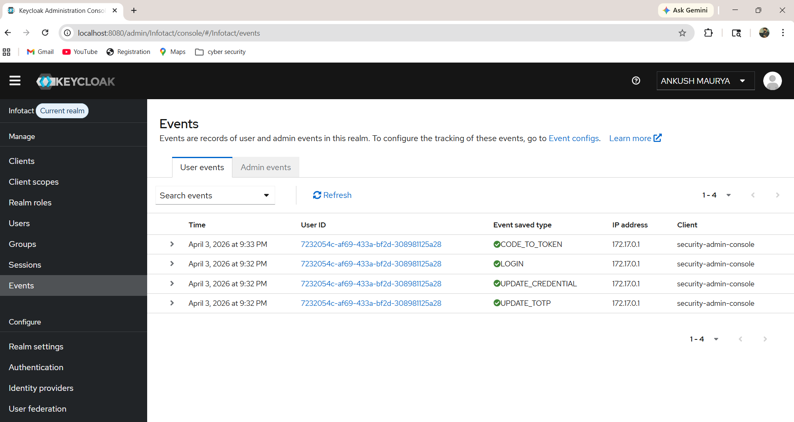
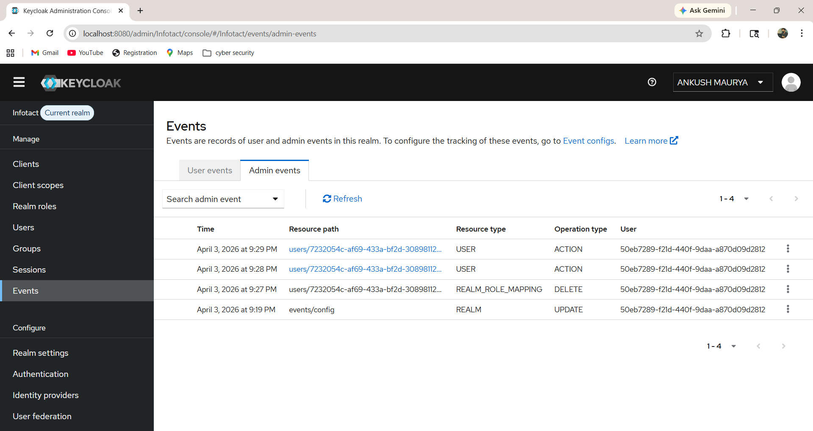
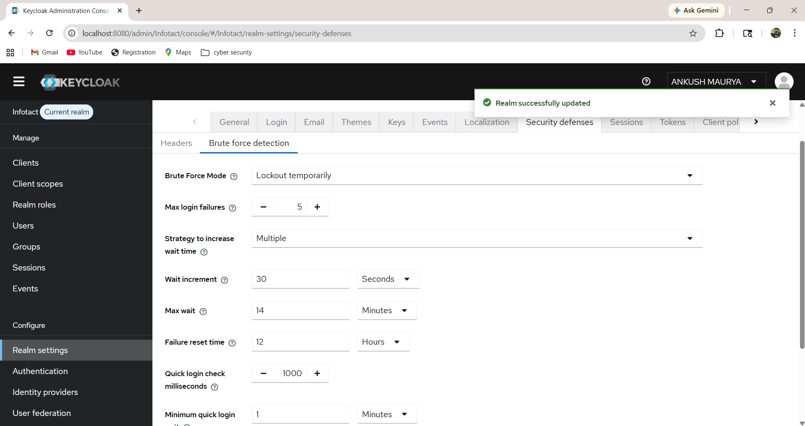

# Week 4 – Security Hardening and Monitoring

## Objective

Enhance the security posture of the centralized Identity Provider by enabling auditing, enforcing password policies, reducing token lifespan, configuring brute-force protection, and replacing temporary admin access with a permanent administrative account.

---

## Tasks Completed

Enabled User Event Logging to track authentication activities.

Enabled Admin Event Logging for configuration-level auditing.

Configured Permanent Admin Account (superadmin) and removed temporary admin dependency.

Applied Password Security Policy enforcement.

Reduced Token Lifespan to improve session security.

Enabled Brute Force Protection to prevent credential attacks.

Validated secure login using permanent admin credentials.

---

## Input

Keycloak Admin Console

Realm Name: Infotact

Configured Users:

- superadmin
- ankush_admin
- ankush_dev
- ankush_view

Security Policies Applied:

Password Policy

Token Lifespan Restrictions

Brute Force Detection

Event Logging

---

## Output

Permanent Admin Account configured successfully

User Event Logging enabled

Admin Event Logging enabled

Password Policy enforced

Access Token lifespan reduced

Brute Force Protection enabled

Improved authentication system security posture

---

## Problems Faced

Temporary admin warning appeared initially.

Login failure while switching admin accounts.

Realm confusion between master and Infotact realm.

---

## Solution

Created permanent admin credentials using superadmin account.

Reset credentials through Keycloak user credential panel.

Logged into correct realm admin console.

Validated authentication security configuration successfully.

---

## Screenshot Evidence

Permanent Admin Login:

Password Policy Configuration:

Token Settings Configuration:

User Event Logging Enabled:

Admin Event Logging Enabled:

Brute Force Protection Enabled:

---

## Result

Security hardening successfully implemented for the centralized Keycloak Identity Provider.

Authentication auditing enabled

Password enforcement policies active

Token expiration hardened

Brute force attack protection enabled

Permanent administrator access configured

Centralized IAM system prepared for production-style Zero Trust identity architecture.